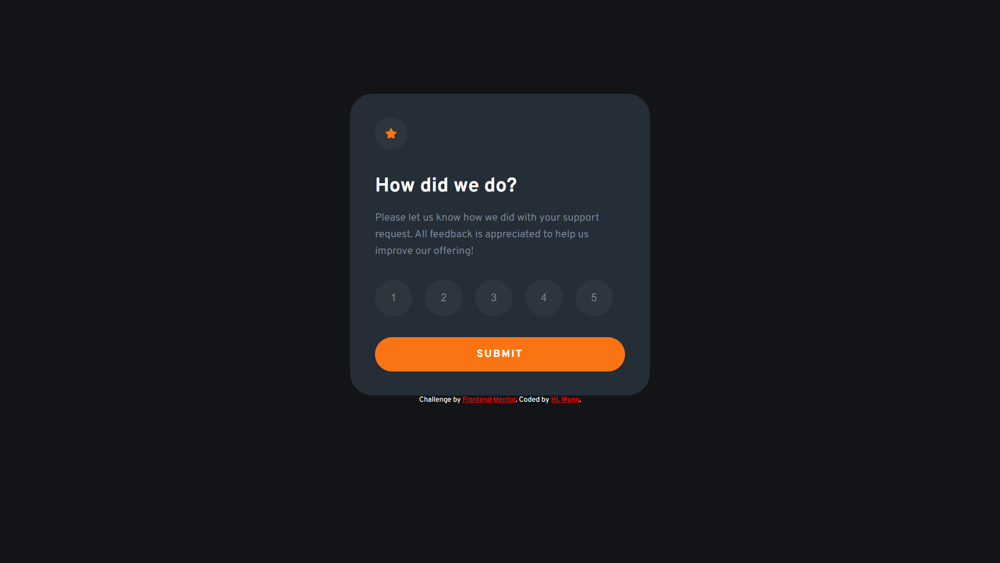
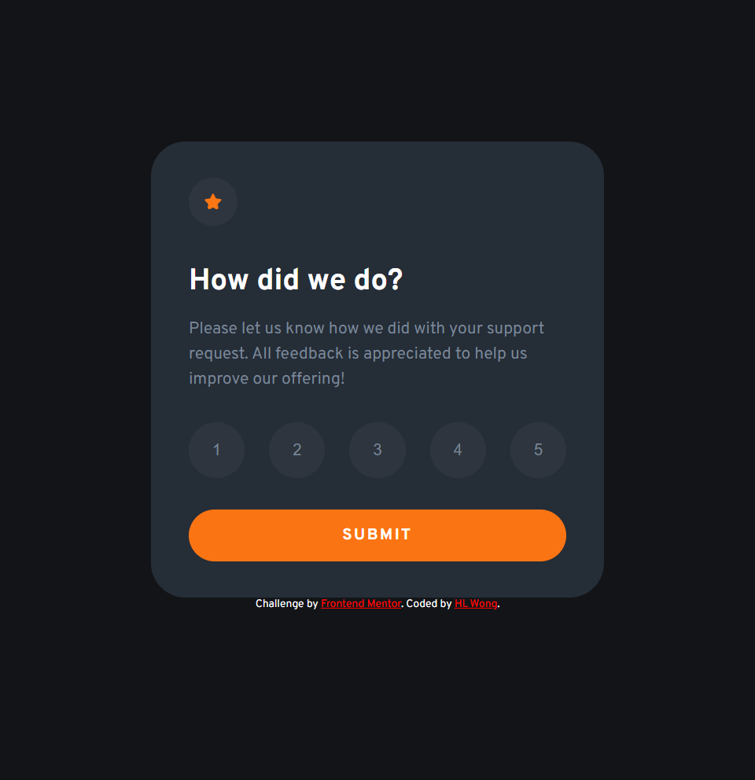
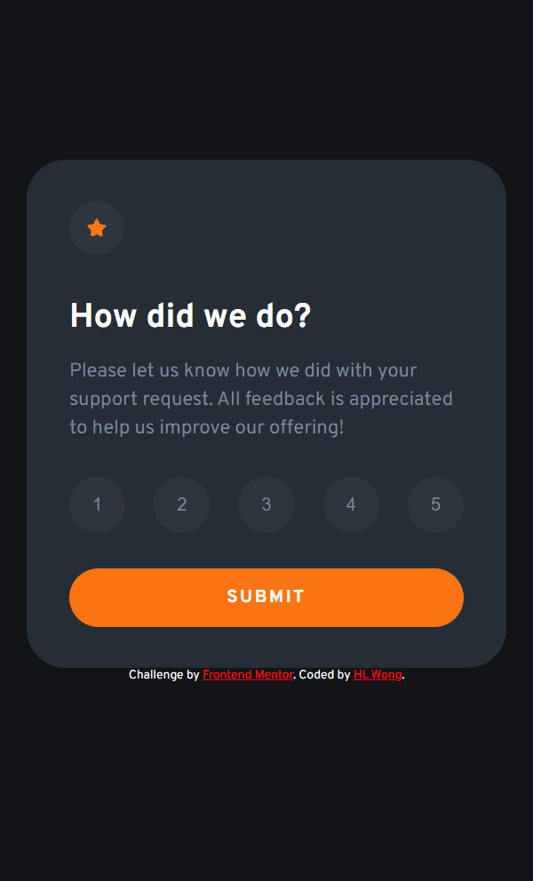

# Frontend Mentor - Interactive rating component solution

This is a solution to the [Interactive rating component challenge on Frontend Mentor](https://www.frontendmentor.io/challenges/interactive-rating-component-koxpeBUmI). Frontend Mentor challenges help you improve your coding skills by building realistic projects. 

## Table of contents

- [Overview](#overview)
  - [The challenge](#the-challenge)
  - [Screenshot](#screenshot)
  - [Links](#links)
- [My process](#my-process)
  - [Built with](#built-with)
  - [What I learned](#what-i-learned)
  - [Continued development](#continued-development)
- [Author](#author)

## Overview

### The challenge

Users should be able to:

- View the optimal layout for the app depending on their device's screen size
- See hover states for all interactive elements on the page
- Select and submit a number rating
- See the "Thank you" card state after submitting a rating

### Screenshot

**Desktop**<br>


**Tablet**<br>


**Mobile**<br>


### Links

- Solution URL: [Frontend Mentor Solution](https://www.frontendmentor.io/solutions/interactive-rating-component-aCv_1IILox)
- Live Site URL: [Live Site](https://dwz-wong.github.io/interactive-rating-component/)

## My process

### Built with

- HTML
- CSS custom properties
- CSS Flexbox
- JavaScript

### What I learned

During this challenge, I learned to make the website responsive using the media query, even though I wondered if I was doing it correctly.

The media query I have added in the css file below:

```css
/* Mobile */
@media (max-width: 480px) {
    .rating__container {
        width: 90%;
    }

    .rating__star {
        width: 14%;
    }

    .rating__description {
        font-size: 1.1rem;
    }

    .btn {
        padding: 1em 1.3em;
        font-size: 1rem;
    }

    .rating__btn-list {
        max-width: 100%;
    }

    .thankyou__container {
        width: 90%;
    }

    .thankyou__description {
        font-size: 1.1rem;
    }
}

/* Tablet */
@media (min-width: 480.5px) and (max-width: 768px) {
    .rating__container {
        width: 60%;
    }

    .rating__star {
        width: 13%;
    }

    .rating__description {
        font-size: 1.05rem;
    }

    .rating__btn-list {
        max-width: 100%;
    }
    
    .thankyou__container {
        width: 60%;
    }

    .thankyou__description {
        font-size: 1.05rem;
    }
}
```

### Continued development

I wish to improve my front-end development skills to make the website I have made much more responsive in the next challenges.

## Author

- DEV - [@dwz_wong](https://dev.to/dwz_wong)
- Frontend Mentor - [@dwz-wong](https://www.frontendmentor.io/profile/dwz-wong)
- Twitter - [@dwz_wong](https://twitter.com/dwz_wong)
